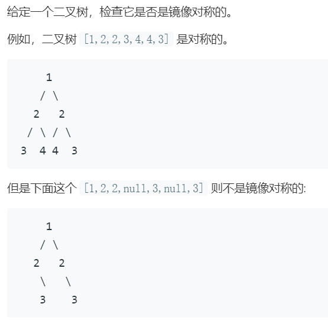
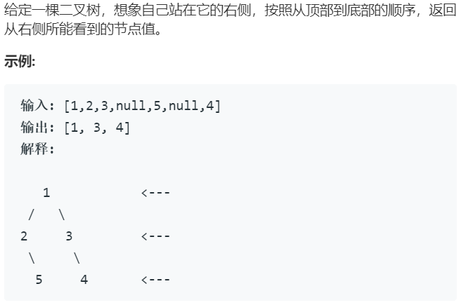

# 深度优先搜索和广度优先搜索
深度优先搜索（Depth-First-Search, DFS）和广度优先搜索（Breadth-First-Search, BFS）都是用于遍历和搜索树或图的算法，最开始接触这两个概念是学习二叉树的遍历时，因此，下面先从二叉树的遍历谈起，再通过leetcode上的几道题谈一谈个人对这两种算法的理解。因个人知识储备的问题，下面不涉及图的相关内容

## 二叉树的深度优先遍历
二叉树的深度优先遍历又分为：前序、中序和后序遍历，代码如下所述：
``` C++
/*
struct Node {
	T data;
	Node *left, *right;

	Node(T elem) : data(elem), left(nullptr), right(nullptr){}
};
*/

void pre_order(Node *root){
	if(root == nullptr){
		return;
	}

	std::cout << root->data << ' ';
	pre_order(root->left);
	pre_order(root->right);
}

void in_order(Node *root){
	if(root == nullptr){
		return;
	}

	in_order(root->left);
	std::cout << root->data << ' ';
	in_order(root->right);
}

void post_order(Node *root){
	if(root == nullptr){
		return;
	}

	post_order(root->left);
	post_order(root->right);
	std::cout << root->data << ' ';
```

## 二叉树的广度优先遍历
也称为层序遍历，优先遍历同一层中的所有元素  
实现的思路是：借助一个普通的队列，先将根结点入队，开始循环，只要队列不为空就执行如下操作：
* 先获取到队首结点
* 如果队首结点的左右子结点存在，则入队
* 对队首结点进行操作（打印value值）
* 将队首结点出队，完成一次循环

``` C++
void level_order(Node *root){
	std::queue<Node*> q;
	q.push(root);
	while(!q.empty()){
		Node *node = q.front();
		if(node->left != nullptr){
			q.push(node->left);
		}

		if(node->right != nullptr){
			q.push(node->right);
		}

		std::cout << node->data << ' ';
		q.pop();
	}
}
```

可以看出来，DFS使用递归方式，借助栈空间完成，不断地将二叉树上的结点入栈，由于栈满足先进后出的原则，所以越是远离根结点的结点越先被访问到，因此DFS算法表现出尽快的远离根结点。BFS则相反，借助队列完成，而队列满足先进先出的原则，所以越是靠近根结点的结点越先访问到  
这里先概括出使用DFS和BFS的原则，再通过下面的示例进行验证  
* DFS通过栈（递归）实现，BFS通过队列实现
* 凡是DFS能解决的，BFS也可以解决
* 优先使用DFS

## [LeetCode 101 对称二叉树](https://leetcode-cn.com/problems/symmetric-tree/)

### DFS解法
``` C++
/**
 * Definition for a binary tree node.
 * struct TreeNode {
 *     int val;
 *     TreeNode *left;
 *     TreeNode *right;
 *     TreeNode(int x) : val(x), left(NULL), right(NULL) {}
 * };
 */
class Solution {
public:
	bool isSymmetric(TreeNode* root) {
		if(root == NULL){
			return true;
		}

		return DFS(root->left, root->right);
	}

	bool DFS(TreeNode *p, TreeNode *q){
		if(p == NULL && q == NULL){
			return true;
		}
		else if(p == NULL || q == NULL){
			return false;
		}

		if(p->val != q->val){
			return false;
		}

		return DFS(p->left, q->right) && DFS(p->right, q->left);
	}
};
```

### BFS解法
``` C++
class Solution {
public:
	bool isSymmetric(TreeNode* root) {
		queue<TreeNode*> q;
		q.push(root);
		q.push(root);

		while(!q.empty()){
			TreeNode *l = q.front();
			q.pop();
			TreeNode *r = q.front();
			q.pop();

			if(l == NULL && r == NULL){
				continue;
			}

			if(l == NULL || r == NULL){
				return false;
			}

			if(l->val != r->val){
				return false;
			}

			q.push(l->left);
			q.push(r->right);
			q.push(l->right);
			q.push(r->left);
		}

		return true;
	}
};
```

## [LeetCode 199 二叉树的右视图](https://leetcode-cn.com/problems/binary-tree-right-side-view/)

### DFS解法
``` C++
/**
 * Definition for a binary tree node.
 * struct TreeNode {
 *     int val;
 *     TreeNode *left;
 *     TreeNode *right;
 *     TreeNode(int x) : val(x), left(NULL), right(NULL) {}
 * };
 */
class Solution {
public:
	vector<int> rightSideView(TreeNode* root) {
		vector<int> result;
		DFS(root, 0, result);
		return result;
	}

	void DFS(TreeNode *root, int level, vector<int> &v){
		if(root == NULL){
			return;
		}

		if(v.size() == level){
			v.push_back(root->val);
		}

		DFS(root->right, level+1, v);
		DFS(root->left, level+1, v);
	}
};
```
递归遍历结点的左右子树，因为是右视图，所以先遍历右子树。对于一个结点，如果存在右子结点，那么将右子结点的值放入vector中，如果不存在，则将左子结点的值放入vector中，有一个问题就是在遍历左结点时怎么知道是否存在右结点呢？这里用到一个变量level，对于同一层的结点，如果result数组的大小已经等于level了，说明右边已经有结点存入数组了，该结点就不用再保存

### BFS解法
``` C++
class Solution {
public:
	vector<int> rightSideView(TreeNode* root) {
		vector<int> result;
		if(root == NULL){
			return result;
		}
		
		queue<TreeNode*> q;
		q.push(root);
		while(!q.empty()){
			result.push_back(q.back()->val);
			int size = q.size();
			for(int i = 0; i < size; ++ i){
				TreeNode *node = q.front();
				if(node->left != NULL){
					q.push(node->left);
				}

				if(node->right != NULL){
					q.push(node->right);
				}

				q.pop();
			}
		}

		return result;
	}
};
```
这个思路是在层序遍历的基础上，保存每层最右边的值，即可得到最后的结果。还是要借助queue，遍历每层的结点时，把下一层的结点都存入到queue中，每当开始新一层结点的遍历之前，先把新一层最后一个结点值存到结果中
