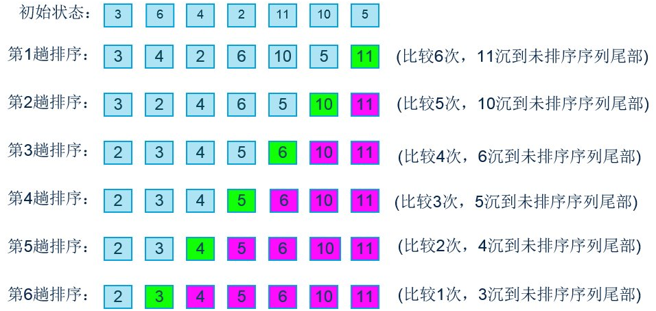
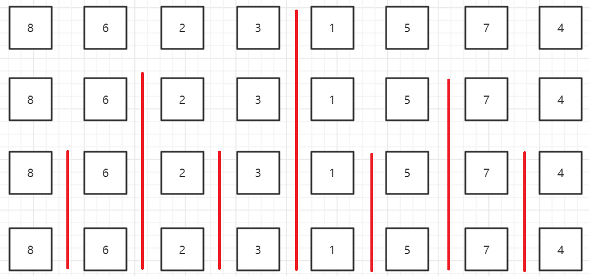

# 排序

## 选择排序
提到“选择”，一定要想到是要选择什么？  
* 如果是从小到大排序的话，是每次循环选择未排序序列中的最小值
* 如果是从大到小排序的话，是每次循环选择未排序序列中的最大值

``` C++
template <typename T>
void select_sort(T array[], int left, int right){
	for(int i = 0; i < right - left; ++ i){
		int min = i;
		for(int j = i + 1; j < right - left + 1; ++ j){
			if(array[j] < array[min]) min = j;
		}

		std::swap(array[i], array[min]);
	}
}
```

### 链表的选择排序
对链表的排序也是需要掌握的，以下对链表的排序均通过[LeetCode147：对链表进行插入排序](https://leetcode-cn.com/problems/insertion-sort-list/)这一题进行验证，其中链表的结点如下定义：
``` C++
struct ListNode {
	int val;
	ListNode *next;
	ListNode(int x) : val(x), next(NULL) {}
};
```

对于链表的排序可以分为两种思路：改变结点位置和改变结点的值，对于不同的排序算法，两者各有优劣，下面一并分析。

``` C++
// 改变结点位置
ListNode* select_sort(ListNode* head) {
	if(head == NULL || head->next == NULL) return head;

	ListNode *dummy = new ListNode(-1);
	dummy->next = head;

	ListNode *pre = dummy, *cur = head;
	while(cur != NULL){
		ListNode *min = cur, *minPre = pre, *findPre = cur, *find = cur->next;
		while(find != NULL){
			if(find->val < min->val){
				min = find;
				minPre = findPre;
			}

			findPre = find;
			find = find->next;
		}

		if(min == cur){
			pre = cur;
			cur = cur->next;
		}
		else{
			minPre->next = min->next;
			pre->next = min;
			pre = min;
			min->next = cur;
		}
	}

	return dummy->next;
}
```

``` C++
// 改变结点的值
ListNode* insertionSortList(ListNode* head) {
	if(head == NULL || head->next == NULL) return head;

	ListNode *cur = head;
	while(cur != NULL){
		ListNode *min = cur, *find = cur->next;
		while(find != NULL){
			if(find->val < min->val){
				min = find;
			}

			find = find->next;
		}

		swap(cur->val, min->val);
		cur = cur->next;
	}

	return head;
}
```
由于选择排序只需要在未排序序列中找到最小值，然后和未排序序列的头部做下交换即可，所以采用改变结点值的方式更简单高效，切不会涉及到大量指针的变动

## 插入排序
类似于打扑克，每次循环从未排序的队列中取出一个元素，和已排序的序列从右向左依次比较、交换  
``` C++
template <typename T>
void insert_sort(T array[], int left, int right){
	for(int i = 1; i < right - left + 1; ++ i){
		for(int j = i; j >= 0; -- j){
			if(array[j] < array[j - 1]) 
				std::swap(array[j], array[j - 1]);
			else 
				break;
		}
	}
}
```
由于插入排序可以提前终止内层循环，所以相比较其他O(N^2)的排序算法来说应该会更优，但是经测试上述代码却没有表现出优势，原因在于内层循环中多次进行了交换操作，因此可以做如下改进：

``` C++
template <typename T>
void insert_sort(T array[], int left, int right){
	for(int i = 1; i < right - left + 1; ++ i){
		int j = i;
		int temp = array[i];
		while(j >= 0 && array[j - 1] > temp){
			array[j] = array[j - 1];
			-- j;
		}

		array[j] = temp;
	}
}
```
注意插入排序会提前终止内存循环，这是一个很重要的性质，对于近乎有序的数组，插入排序的时间复杂度接近O(N)，比一些O(NlogN)的排序算法更优

### 链表的插入排序
``` C++
// 改变结点位置
ListNode* insert_sort(ListNode* head) {
	if(head == NULL || head->next == NULL) return head;

	ListNode *dummy = new ListNode(-1);
	dummy->next = head;

	ListNode *pre = head, *cur = head->next;
	while(cur != NULL){
		if(pre->val <= cur->val){
			pre = cur;
			cur = cur->next;
			continue;
		}

		ListNode *insertPre = dummy, *insert = dummy->next;
		while(insert != cur && insert->val < cur->val){
			insertPre = insert;
			insert = insert->next;
		}

		pre->next = cur->next;
		cur->next = insert;
		insertPre->next = cur;
		cur = pre->next;
	}

	return dummy->next;
}
```
由于插入排序需要从未排序序列中拿到一个数插入到已排序序列中，所以如果采用改变结点值的方式会频繁改变很多结点的值，效率不高，所以应优先采用改变结点位置的方式

## 冒泡排序
从无序序列头部开始，进行两两比较，根据大小交换位置，直到将最大（小）的数据元素交换到了无序序列的尾部，从而成为有序序列的一部分；下一次继续这个过程，直到所有数据元素都排好序，如下图所示：  
  

``` C++
template <typename T>
void bubble_sort(T array[], int left, int right){
	for(int i = 0; i < right - left; ++ i){
		for(int j = 0; j < right - left - i; ++ j){
			if(array[j] > array[j + 1]) std::swap(array[j], array[j + 1]);
		}
	}
}
```

### 链表的冒泡排序
对链表的冒泡排序没必要掌握，如果有兴趣可以自行实现验证

## 归并排序
对于一个数组，先分成两部分，对每一部分进行排序，之后再将两部分进行归并。而对于两部分中的每一部分排序的方式又是划分成两部分，直到划分到每一部分之后一个元素，这时候就不需要排序了，因为一个元素本身就是有序的，接下来就是从下向上层层归并，最后就得到了一个有序的数组



上图展示了数组的划分，下面讲一讲归并过程，归并过程本身也是一种算法，用于解决：给你两个有序的数组，怎么合并成一个有序的数组，比如[LeetCode88：合并两个有序数组](https://leetcode-cn.com/problems/merge-sorted-array)
解决的思路是：需要开辟一个两个数组a，b长度之和的数组c，之后用三个索引i，j，k来分别遍历三个数组，依次比较数组a，b索引i，j处的元素大小，将小的元素放入数组c索引k处，这样就可以将两个数组合并成了一个有序的数组了。以下代码已在[LeetCode88：合并两个有序数组](https://leetcode-cn.com/problems/merge-sorted-array)验证

``` C++
void merge(vector<int>& nums1, int m, vector<int>& nums2, int n) {
	if(m == 0) {
		nums1 = nums2;
		return;
	} 
	
	if(n == 0) return;

	vector<int> tmp(nums1.begin(), nums1.begin() + m);
	int i = 0, j = 0;
	for(int k = 0; k < m + n; ++ k){
		if(i == m){
			nums1[k] = nums2[j];
			++ j;
		}
		else if(j == n){
			nums1[k] = tmp[i];
			++ i;
		}
		else if(tmp[i] <= nums2[j]){
			nums1[k] = tmp[i];
			++ i;
		}
		else{
			nums1[k] = nums2[j];
			++ j;
		}
	}
}
```

归并排序有递归和迭代两种实现方式，下面分别来看：
``` C++
// 合并两个有序的部分
template<typename T>
void merge(T array[], int left, int middle, int right){
	T tmp[right - left + 1];
	for(int i = left; i <= right; ++ i){
		tmp[i-left] = array[i];
	}

	int i = left, j = middle + 1;
	for(int k = left; k <= right; ++ k){
		if(i > middle){
			array[k] = tmp[j-left];
			++ j;
		}
		else if(j > right){
			array[k] = tmp[i-left];
			++ i;
		}
		else if(tmp[i-left] < tmp[j-left]){
			array[k] = tmp[i-left];
			++ i;
		}
		else{
			array[k] = tmp[j-left];
			++ j;
		}
	}
}

// 迭代
template<typename T>
void merge_sort(T array[], int left, int right){
	int size = right - left + 1;
	for(int i = 1; i < size; i *= 2){
		for(int j = 0; j < size; j += 2 * i){
			merge(array, j, std::min(j + i - 1, size - 1), std::min(j + 2 * i - 1, size - 1));
		}
	}
}

// 递归
template <typename T>
void merge_sort_recursive(T array[], int left, int right){
	if(left >= right){
		return;
	}

	int middle = (right - left) / 2 + left;
	merge_sort_recursive(array, left, middle);
	merge_sort_recursive(array, middle + 1, right);
	merge(array, left, middle, right);
}
```

归并排序的优化：
* 对于一个近乎有序的一组数来说，非常有可能在merge之前，数组的这部分已经是有序的了，所以可以在merge之前加上判断条件

``` C++
if(array[middle] >= array[middle + 1])
	merge(array, left, middle, right);
```
由于要merge的两部分都已经是有序的了，所以`array[middle]`是第一部分的最大值，`array[middle + 1]`是第二部分的最小值，所以如果`array[middle]` > `array[middle + 1]`则两部分不用进行merge  

* 归并排序中加入插入排序进行优化：在数据规模小到一定程度时插入排序的性能将优于归并排序  
``` C++
if(right - left < 15)
	insert_sort(array, left, right);
```

### 链表的归并排序
链表的归并排序同样也是有递归和迭代两种写法的，一下提供的两种写法均通过[leetcode148：排序链表](https://leetcode-cn.com/problems/sort-list/)验证，其中根据题目的要求，时间复杂度O(NlogN)，空间复杂度O(1)，所以只有迭代的写法满足题目要求，递归需要用到O(logN)的系统栈空间，不满足要求  
其中的merge操作也是[LeetCode21：合并两个有序链表](https://leetcode-cn.com/problems/merge-two-sorted-lists/)的解

``` C++
// 递归
ListNode* sortList(ListNode* head) {
	if(head == NULL || head->next == NULL) return head;

	auto slow = head, fast = head->next;
	while(fast != NULL && fast->next != NULL){
		slow = slow->next;
		fast = fast->next->next;
	}

	fast = slow;
	slow = slow->next;
	fast->next = NULL;

	auto left = sortList(head);
	auto right = sortList(slow);

	return merge(left, right);
}

ListNode* merge(ListNode* l1, ListNode* l2) {
	if(l1 == NULL) return l2;
	if(l2 == NULL) return l1;

	auto dummy = new ListNode(-1);
	auto cur = dummy, left = l1, right = l2;
	while(left != NULL || right != NULL){
		if(left == NULL){
			cur->next = right;
			break;
		}
		else if(right == NULL){
			cur->next = left;
			break;
		}
		else if(left->val <= right->val){
			cur->next = left;
			left = left->next;
		}
		else{
			cur->next = right;
			right = right->next;
		}

		cur = cur->next;
	}

	return dummy->next;
}


// 迭代
ListNode* sortList(ListNode* head) {
	if(head == NULL || head->next == NULL) return head;

	auto dummy = new ListNode(-1);
	dummy->next = head;

	int n = 0;
	for(auto p = head; p; p = p->next) ++ n;
	for(int i = 1; i < n; i *= 2){
		auto cur = dummy;
		for(int j = 0; j + i < n; j += 2 * i){
			auto left = cur->next, right = left;
			for(int k = 0; k < i; ++ k) right = right->next;
			int l = 0, r = 0;
			while(l < i && r < i && right){
				if(left->val <= right->val){
					cur = cur->next = left;
					left = left->next;
					++ l;
				}
				else{
					cur = cur->next = right;
					right = right->next;
					++ r;
				}
			}

			while(l < i){
				cur = cur->next = left;
				left = left->next;
				++ l;
			}

			while(r < i && right){
				cur = cur->next = right;
				right = right->next;
				++ r;
			}

			cur->next = right;
		}
	}

	return dummy->next;
}
```

## 快速排序


## 堆排序
