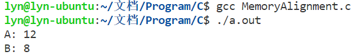
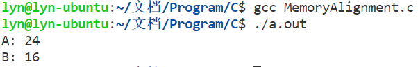

# 内存对齐
看了很多篇有关内存对齐的文章，看得是云里雾里的，花了很长时间才搞清楚内存对齐相关问题，这里整理下，方便其他像我这样的小白查阅  

## 什么是内存对齐？
先通过一段代码了解下内存对齐现象  
``` C
#include <stdio.h>

struct A {
	char a;		// 1字节
	int b;		// 4字节
	short c;	// 2字节
};

struct B {
	char a;		// 1字节
	short c;	// 2字节
	int b;		// 4字节
};

int main(){
	struct A a;
	printf("A: %ld\n", sizeof(a));

	struct B b;
	printf("B: %ld\n", sizeof(b));

	return 0;
}
```
如上定义了两个结构A和B，其中的成员都是基础类型，每个成员所占的字节数都已注释出，都是总过占7字节，那么sizeof(a)和sizeof(b)结果是7吗？结果如下：  
  
是不是感觉很奇怪，为什么结果会是两个毫不相关的值呢？原因就是发生了**内存对齐**，下面会解释为什么是这样的结果  
在计算机中虽然内存空间都是按照byte（字节）划分的，从理论上讲对任何类型的变量的访问可以从任何地址开始，但是实际上计算机系统对数据在内存中存放的位置是有诸多限制的，这就是所谓的内存对齐 **[1]**，那些对变量存放位置的限制也就是内存对齐规则 

## 内存对齐规则
内存对齐主要遵循如下规则：
1. 结构体变量的起始地址能够被其**最宽成员的大小**整除
2. 结构体中每个成员相对于起始地址的偏移能够被其**自身大小**整除，如果不能则在前一个成员后面补充字节
3. 结构体总体大小能够被**最宽成员的大小**整除，如不能则在后面补充字节
4. 如果结构体的成员为结构体对象，则在内存对齐时该成员的大小为其内部**最宽成员的大小**，而不是该结构对象实际的大小

编译器在编译时可以指定对齐大小，代码中通过`#pragma pack(n)`来指定对齐大小，所以实际在内存对齐时是按照上面加粗部分的大小与所指定大小的最小值来操作的。在32位系统上默认的对齐大小为4，64位系统上为8  
下面依据内存对齐规则分析上面程序的结果：
* 对于struct A，假设起始地址为0x0000，结构中最宽成员为int b，占4字节，起始地址可以被4整除，满足规则1；成员char a占1个字节，地址为0x0000；成员int b的地址不能从0x0001开始，因为不满足规则2，所以应填充3字节，使得成员b所占的地址为0x0004~0x0007；成员short c占2字节，地址为0x0008~0x0009；为了满足规则3，需要在后面填充2字节，所以struct A的变量占12字节  
* 对于struct B，也假设起始地址为0x0000，显然满足规则1；char a地址0x0000；short c地址不能从0x0001开始，所以填充1字节，地址为0x0002~0x0003；此时int b的起始地址0x0004满足规则2，所以地址为0x0004~0x0007；此时结构体的总体大小为8字节满足规则3，所以struct B的变量占8字节  

可以修改struct A和struct B来再次验证内存对齐规则  
``` C
struct A {
	char a;
	double b;
	short c;
};

struct B {
	char a;
	short c;
	double b;
};
```
此时结构中最宽成员为double b，占8字节，测试环境为64位，所以内存对齐时所依据的大小为8，结果如下：
  
如果可以自行分析出为什么是这样的结果，就彻底掌握了什么是内存对齐以及如何进行内存对齐。下面探讨下为什么要进行内存对齐？

## 为什么要内存对齐？
具体的分析可以参考[C/C++内存对齐详解](https://zhuanlan.zhihu.com/p/30007037)  
总结就是：核心是为了提高CPU访问数据的效率；再者就是为了跨平台移植问题，不是所有的硬件平台都能访问任意地址上的任意数据的；某些硬件平台只能在某些地址处取某些特定类型的数据，否则抛出硬件异常 **[2]**

## 内存对齐带来的问题
最直观的问题就是：内存浪费，结构中数据成员之间留下了额外的空间，造成了浪费，这对内存资源受限的环境是应当重视的   
目前就想到了这一个存在的问题，如果还有的话，再回来补充  

## 参考文献
* [1]. [C/C++内存对齐详解](https://zhuanlan.zhihu.com/p/30007037) -- 忆臻
* [2]. [内存对齐](https://baike.baidu.com/item/%E5%86%85%E5%AD%98%E5%AF%B9%E9%BD%90/9537460) -- 百度百科