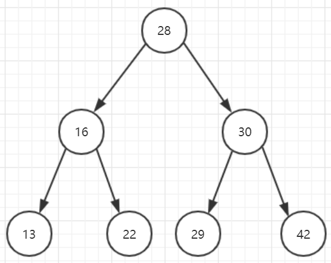
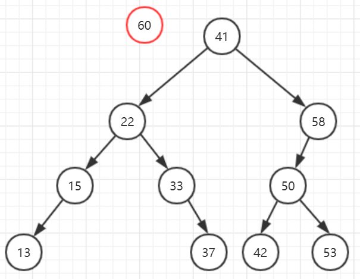
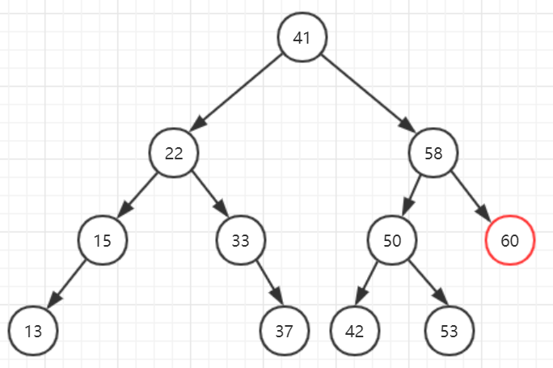
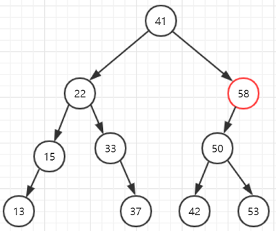
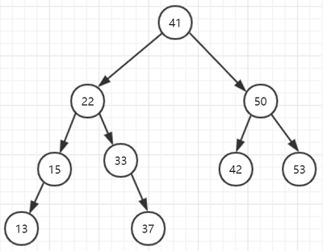
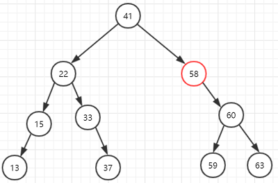
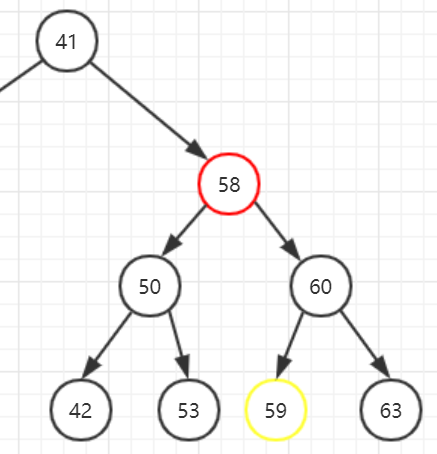
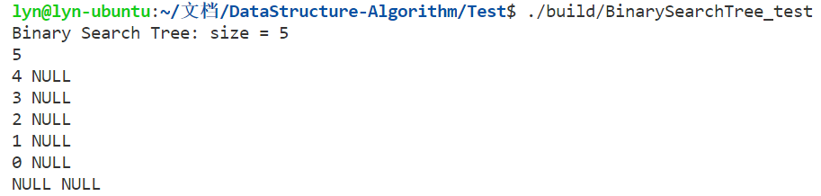
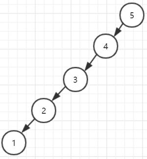

# 二叉搜索树
## 二叉搜索树定义
二叉搜索树也称为二叉查找树、二叉排序树，是一种插入、删除、查找操作性能都不错的数据结构  
二叉搜索树首先还是一棵二叉树，但是这个二叉树有一些特点：对于树中的每个结点，
* 如果左子树存在，那么左子树中所有结点的值都小于该结点的值
* 如果右子树存在，那么右子树中所有结点的值都大于该结点的值
* 树中没有值相等的结点

下图就是一棵二叉搜索树，可见满足上述二叉搜索树的特点  
  

## 二叉搜索树实现
### 二叉搜索树的结构定义
二叉搜索树不一定是一棵完全二叉树，所有不能使用顺序存储结构来实现，而是采用链式存储结构来实现  
``` C++
template<typename T>
class BinarySearchTree : copyable {
private:
	struct Node {
		T data;
		Node *left;
		Node *right;

		Node(T val) : data(val), left(nullptr), right(nullptr){}
	};

public:
	BinarySearchTree() : m_root(nullptr), m_size(0){}

	BinarySearchTree(const BinarySearchTree &other){ /* TODO */ }

	~BinarySearchTree(){
		if(m_root == nullptr){
			return;
		}

		std::queue<Node*> q;
		q.push(m_root);
		Node *cur;
		while(!q.empty()){
			cur = q.front();
			q.pop();
			if(cur->left){
				q.push(cur->left);
			}

			if(cur->right){
				q.push(cur->right);
			}

			delete cur;
		}
	}

	int size() const {
		return m_size;
	}

	bool empty() const {
		return m_size == 0;
	}

	/**
	 * @brief 插入结点（迭代）
	*/
	void insert(T data);

	/**
	 * @brief 插入结点（递归）
	*/
	void insert_recursive(T data);

	/**
	 * @brief 查找（递归）
	 * @return 成功找到返回true，否则返回false
	*/
	bool find(T data);

	/**
	 * @brief 查找（迭代）
	 * @return 成功找到返回true，否则返回false
	*/
	bool find_recursive(T data);

	/*
	 * @brief 删除结点（迭代）
	*/
	void erase(T data);

	/**
	 * @brief 删除结点（递归）
	*/
	void erase_recursive(T data);

private:
	Node *m_root;
	int m_size;
};
```

### 插入结点操作
用一个具体的示例描述下二叉搜索树插入结点的过程，如下图所示：  

  

对于一个已经存在诸多结点的二叉搜索树，插入一个值为60的结点，首先和根结点41比较，大于41则应放在右子树中，再和右子树中的58比较，大于58，则应放在以58为根结点的右子树中，因为58结点没有右子结点，所以直接加在58的右子结点上。下图是完成插入操作之后二叉搜索树  

  

同理如果插入一个小于根结点41的数，则应和左子树进行比较来找到合适的位置插入。还有一种情况是如果要插入的结点的值已经在树中存在了，由于二叉搜索树不允许存储值相同的结点，此时不应做插入操作。下面用递归和迭代两种方式实现上述插入结点操作的过程。  
``` C++
/**
 * @brief 插入结点（迭代）
*/
void insert(T data){
	if(m_root == nullptr){
		m_root = new Node(data);
		return;
	}

	Node *cur = m_root;
	Node *parent;
	while(cur != nullptr){
		parent = cur;
		if(cur->data == data){
			return;
		}
		else if(cur->data > data){
			cur = cur->left;
		}
		else{
			cur = cur->right;
		}
	}

	if(parent->data > data){
		parent->left = new Node(data);
	}
	else if(parent->data < data){
		parent->right = new Node(data);
	}
}

/**
 * @brief 插入结点（递归）
*/
void insert_recursive(T data){
	m_root = insert(m_root, data);
	std::cout << "insert" << std::endl;
}

private:
	Node* insert(Node *node, T data){
		if(node == nullptr){
			++ m_size;
			return new Node(data);
		}

		if(data < node->data){
			node->left = insert(node->left, data);
		}
		else if(data > node->data){
			node->right = insert(node->right, data);
		}

		return node;
	}
```

### 查找操作
查找操作的思路和插入结点操作是一样的，首先判断要查找的值和根结点的值进行比较，
* 如果正好等于则表示已找到返回true
* 如果大于则在右子树中查找
* 如果小于则在左子树中查找
* 当遍历到结点为空时，表示没能找到返回false

``` C++
/**
 * @brief 查找（迭代）
 * @return 成功找到返回true，否则返回false
*/
bool find(T data) const {
	Node *cur = m_root;
	while(cur != nullptr){
		if(data == cur->data){
			return true;
		}
		else if(data < cur->data){
			cur = cur->left;
		}
		else{
			cur = cur->right;
		}
	}

	return false;
}

/**
 * @brief 查找（递归）
 * @return 成功找到返回true，否则返回false
*/
bool find_recursive(T data) const {
	return find(m_root, data);
}

private:
	bool find(Node *node, T data) const {
		if(node == nullptr){
			return false;
		}

		if(data == node->data){
			return true;
		}
		else if(data < node->data){
			return find(node->left, data);
		}
		else{
			return find(node->right, data);
		}
	}
```

### 删除结点操作
删除结点操作的实现要比插入和查找难一些，下面分两种情况分析：
* 要删除的结点只有左子树或者右子树，此时删除简单些，例如下图所示的例子

    
上图要删除的结点58只有左子树，没有右子树，此时将其父结点41的右指针指向50结点，并将58结点删除即可。删除只有右子树的结点也是一样的  
    

* 要删除的结点既有左子树又有右子树，这种情况就比较复杂了，需要用到Hubbard Deletion算法，如下图所示：
   

要删除的结点58既有左子树又有右子树，Hubbard Deletion算法中指出，代替58结点的是58结点右子树中的最小值，也就是59结点（也可以是左子树中最大值53结点），删除58结点并用59结点代替的思路如下：
* 首先从58结点右子树中删除59结点，保留59结点为s
* s->left = 50结点
* s->right = 60结点
* 41结点->right = s

``` C++
/**
	* @brief 删除结点（迭代）
*/
void erase(T data){
	// TODO
}

/**
	* @brief 删除结点（递归）
*/
void erase_recursive(T data){
	if(m_size == 0){
		return;
	}

	m_root = erase(m_root, data);
}

private:
	Node* erase(Node *node, T data){
		if(node == nullptr){
			return nullptr;
		}

		if(node->data > data){
			node->left = erase(node->left, data);
			return node;
		}
		else if(node->data < data){
			node->right = erase(node->right, data);
			return node;
		}
		else{
			if(node->left == nullptr){
				Node *right = node->right;
				delete node;
				-- m_size;
				return right;
			}

			if(node->right == nullptr){
				Node *left = node->left;
				delete node;
				-- m_size;
				return left;
			}

			if(node->left != nullptr && node->right != nullptr){
				Node *successor = new Node(get_min(node->right));
				successor->right = earse_min(node->right);
				successor->left = node->left;

				delete node;
				-- m_size;
				return successor;
			}
		}
	}

	T get_min(Node *node) const {
    if(node->left == nullptr){
			return node->data;
    }

    return get_min(node->left);
	}

	Node *earse_min(Node *node){
    if(node->left == nullptr){ 
			Node *right = node->right;
			delete node;
			-- m_size;
			return right;
    }

    node->left = earse_min(node->left);
    return node;
	}
```

完整的代码见：[https://github.com/liuyunian/DataStructure-Algorithm/blob/master/BinaryTree/BinarySearchTree.h](https://github.com/liuyunian/DataStructure-Algorithm/blob/master/BinaryTree/BinarySearchTree.h)  

## 二叉搜索树存在的问题
插入一组近乎有序的树会使得二叉搜索树退化成一个链表，如下测试代码：
``` C++
int main(){
	set::BinarySearchTree<int> bstSet;
	for(int i = 5; i >= 0; -- i){
		bstSet.insert(i);
	}

	bstSet.print();

	return 0;
}
```
执行结果如下图：
  

此时表示的二叉搜索树就是如下的样子，可见所有结点的右指针都为空，退化成了链表，此时插入、删除、查找等操作的时间复杂度将不再是O(logN)，而是O(N)    
  

解决方法就是在二叉搜索树的基础上实现平衡二叉树，平衡二叉树很自动平衡左右子树的高度，避免退化成链表，常见的衡二叉树实现有：红黑树、2-3树、AVL树、Splay树  