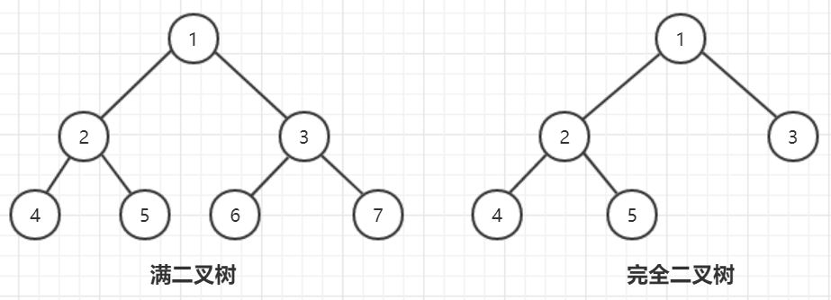
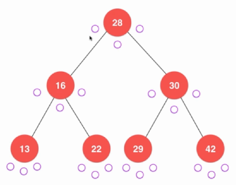

# 树
线性表是处理一对一关系的数据结构，这里的一对一是指：在线性表中一个结点只有一个前驱结点和一个后继结点（头结点和尾结点除外）  
树是处理一对多关系的数据结构，一个结点有一个父结点和多个子结点，所以树型结构有两个特点：
* 树有一个根结点，而且这个根结点是唯一的
* 一个结点有且仅有一个父结点，可以有多个子结点（当然也可以没有）

## 树中结点的分类
* 根结点
* 内部结点：不是根结点，并且有子结点的结点
* 叶结点：没有子结点的结点

## 树的相关概念
* 度：一个结点子结点的个数
* 树的度：树中结点度的最大值
* 树的深度：树中结点的最大层次数
* 有序树和无序树：如果各子树从左到右是有顺序的，不能互换位置的，那么该树就是有序树，否则为无序树

# 二叉树
在树型结构中，一个结点最多有两个子结点，并且这两个结点是区分左右的，次序是不能变的（类似于左右手），这样的一种特殊的树型结构称为二叉树  
二叉树也是我们主要关注的树型结构

## 二叉树的特点
* 每个结点最多有两个子树，没有子树，或者只有一个子树
* 两个子树一定是严格区分左右的
* 只有一个子树时也是要区分左右的

## 特殊的二叉树
* 斜树：所有结点有只有左子树或右子树，得到的结构和线性表一样，所以线性表可以看做是树的一个特殊形式
* 满二叉树：一棵深度为k，且有2^(k-1)个结点的二叉树
* 完全二叉树：若设二叉树的深度为h，除第h层外，其它各层(1～h-1)的结点数都达到最大个数，第h层所有的结点都连续集中在最左边，这就是完全二叉树  

满二叉树和完全二叉树如下图所示：  
  
可见，满二叉树一定是完全二叉树；完全二叉树不一定是满二叉树  

## 二叉树的性质
* 在二叉树的第i层上最多有2^(i-1)个结点
* 深度为k的二叉树最多有2^k-1个结点
* 包含n个结点的二叉树的高度至少为log2(n+1)
* 对于任何一棵非空的二叉树,如果叶结点个数为n0，度数为2的结点个数为n2，则有：n0=n2+1

## 二叉树的实现
二叉树的实现是指利用顺序存储结构或者链式存储结构来存储二叉树中的元素，但是元素之间的关系要满足二叉树表征的关系（根结点、左右树）  
先来看顺序存储结构，可以为二叉树中的每个元素都编上序号，序号和数组的index对应，这样就可以存储在数组（顺序存储结构）中了，但是怎么表征元素之间的关系呢？先来看完全二叉树，如下图所示：
   
对于完成二叉树，如果根结点从1开始标号的话，元素之间的关系可以用下标表示：结点i左子结点的标号为2i，右子结点的标号为2i+1，父结点的标号是i/2(这里存在取整)。所以说对于完成二叉树一般是通过顺序存储结构实现  
那么对于非完全二叉树呢？当然可以按照完全二叉树来标号，但是因为会缺少几个结点，所以造成了存储空间的浪费，所以对于普通的二叉树都是采用链式存储结构实现  

### 完全二叉树
``` C++
template <typename T>
class CompleteBinaryTree : copyable {
public:
	CompleteBinaryTree(int size, T data[]) :
		m_size(size),
		m_data(new T[m_size+1])
	{
		for(int i = 1; i < m_size+1; ++ i){
			m_data[i] = data[i-1];
		}
	}

	CompleteBinaryTree(const CompleteBinaryTree &other);
	
	~CompleteBinaryTree(){
		delete[] m_data;
	}

	CompleteBinaryTree& operator=(const CompleteBinaryTree &other);

	int size() const {
		return m_size;
	}

	bool empty() const {
		return m_size == 0;
	}

private:
	int m_size;
	T *m_data;
};
```

### 普通二叉树
利用二叉链表来实现，每个结点由一个数据域data，两个指针域left和right分别指向左右子结点  
``` C++
template<typename T>
class BinaryTree : copyable {
private:
	struct Node{
		T data;
		Node *left;
		Node *right;

		Node(T elem) : data(elem), left(nullptr), right(nullptr) {}
	};

public:
	BinaryTree() : 
		m_root(nullptr),
		m_size(0)
	{}

	BinaryTree(const BinaryTree &other);

	~BinaryTree(){
		std::queue<Node*> q;
		q.push(m_root);
		while(!q.empty()){
			Node *node = q.front();
			if(node->left != nullptr){
				q.push(node->left);
			}

			if(node->right != nullptr){
				q.push(node->right);
			}

			delete node;
			q.pop();
		}
	}

	int size() const {
		return size;
	}

	bool empty() const {
		return size == 0;
	}

	BinaryTree& operator=(const BinaryTree &other);

private:
	Node *m_root;
	int m_size;
};
```

## 二叉树的遍历
遍历是二叉树主要的操作，是其他操作的基础。二叉树的遍历主要分为两种：
### 深度优先遍历
深度优先遍历是指优先向下找寻子结点。分为：
* 前序遍历：先访问当前结点，再依次递归访问左右子树
* 中序遍历：先递归访问左子树，再访问当前结点，再递归访问右子树
* 后序遍历：先递归访问左右子树，再访问自身结点

用一张图即可搞懂前中后序遍历的顺序，每个结点有三个点表示前序、中序、后序点，顺着点和连接线描轮廓，前序遍历按照描到前序点的顺序输出。中序和后序遍历则是按照描到中序和后序点的顺序输出  
  

下面的深度优先遍历的代码，由递归和迭代两种方式实现：
``` C++
/**
 * @brief 前序遍历（迭代）
*/
void pre_order(){
	std::cout << "pre order: ";
	stack<Node*> s;
	Node *cur = m_root;
	while(cur != nullptr || !s.empty()){
		while(cur != nullptr){
			std::cout << cur->data << ' ';
			s.push(cur);
			cur = cur->left;
		}

		if(!s.empty()){
			cur = s.top();
			s.pop();
			cur = cur->right;
		}
	}
	std::cout << std::endl;
}

/**
 * @brief 前序遍历（递归）
*/
void pre_order_recursive(){
	std::cout << "pre order: ";
	pre_order(m_root);
	std::cout << std::endl;
}

/**
 * @brief 中序遍历（迭代）
*/
void in_order(){
	std::cout << "in order: ";
	stack<Node*> s;
	Node *cur = m_root;
	while(cur != nullptr || !s.empty()){
		while(cur != nullptr){
			s.push(cur);
			cur = cur->left;
		}

		if(!s.empty()){
			cur = s.top();
			std::cout << cur->data << ' ';
			s.pop();
			cur = cur->right;
		}
	}
	std::cout << std::endl;
}

/**
 * @brief 中序遍历（递归）
*/
void in_order_recursive(){
	std::cout << "in order: ";
	in_order(m_root);
	std::cout << std::endl;
}

/**
 * @brief 后序遍历（迭代）
*/
void post_order(){
	std::cout << "post order: ";
	stack<Node*> s;
	Node *cur = m_root, *pre = nullptr;
	while(cur != nullptr || !s.empty()){
		while(cur != nullptr){
			s.push(cur);
			cur = cur->left;
		}

		if(!s.empty()){
			cur = s.top();
			if(cur->right == nullptr || cur == pre){
				std::cout << cur->data << ' ';
				pre = cur;
				cur = nullptr;
				s.pop();
			}
			else{
				cur = cur->right;
			}
		}
	}
	std::cout << std::endl;
}

/**
 * @brief 后序遍历（递归）
*/
void post_order_recursive(){
	std::cout << "post order: ";
	post_order(m_root);
	std::cout << std::endl;
}

private:
void pre_order(Node *node){
	if(node == nullptr){
		return;
	}

	std::cout << node->data << ' ';
	pre_order(node->left);
	pre_order(node->right);
}

void in_order(Node *node){
	if(node == nullptr){
		return;
	}

	in_order(node->left);
	std::cout << node->data << ' ';
	in_order(node->right);
}

void post_order(Node *node){
	if(node == nullptr){
		return;
	}

	post_order(node->left);
	post_order(node->right);
	std::cout << node->data << ' ';
}
```

### 广度优先遍历
广度优先遍历也称为层序遍历，优先遍历同一层中的所有元素  
实现的思路是：借助一个普通的队列，先将根结点入队，根结点是很容易拿到。开始一个循环，只要队列不为空就执行如下操作：
* 先获取到队首结点
* 如果队首结点的左右子结点存在，则入队
* 对队首结点进行操作（打印value值）
* 将队首结点出队，完成一次循环

``` C++
/**
 * @brief 层序遍历
*/
void level_order(){
	std::cout << "level order: ";

	std::queue<Node*> q;
	q.push(m_root);
	while(!q.empty()){
		Node *cur = q.front();
		if(cur->left != nullptr){
			q.push(cur->left);
		}

		if(cur->right != nullptr){
			q.push(cur->right);
		}

		std::cout << cur->data << ' ';
		q.pop();
	}

	std::cout << std::endl;
}
```

完整代码见：[完全二叉树](https://github.com/liuyunian/DataStructure-Algorithm/blob/master/BinaryTree/CompleteBinaryTree.h)、[二叉树](https://github.com/liuyunian/DataStructure-Algorithm/blob/master/BinaryTree/BinaryTree.h)

# 线索二叉树
线索二叉树不太常用，这里简单介绍下：  
引入线索二叉树的目的就是充分利用二叉树中空着的指针域，假设一棵二叉树有n个结点，那么一共就会有2n个指针域（left、right），但是n个结点连接起来需要n-1条连线，也就是利用了n-1个指针域，这样就浪费了n+1个指针域，显然非常浪费空间。
线索二叉树是利用遍历（前、中、后、层序遍历）得到结点间的线性关系，然后利用空着的指针域去记录这种线性关系，也就是记录结点的前驱和后继  
如果所用的二叉树需要经常遍历或查找结点时需要某种遍历序列中的前驱和后继，那线索二叉树非常适合  