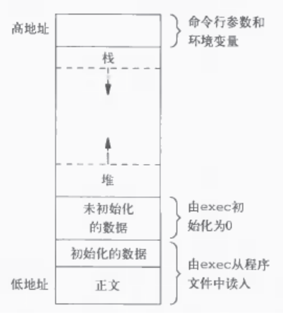

# C/C++面试常问问题总结
经过刷其他人的面经和回顾自己的面试经历，在面试中C/C++常问问题总结如下： 

## C程序的存储空间布局
一个编译链接之后生成的可执行程序，在存储时分为代码段（text）、数据段（data）、未初始化数据段（BSS）
* text段：存放程序的执行代码和一些常量，该存储区域是只读的
* data段：存放程序中已初始化的全局变量，静态内存分配
* BSS段：存放程序中未初始化的全局变量，静态内存分配
需要注意的是BSS段只记录大小并不分配空间，加载进内存执行时才根据记录的大小分配空间并清0

程序运行之后就多了三个内存区域：堆区、栈区和存储命令行参数、环境变量的区域
* 栈区：存放局部变量和函数参数，由编译器释放内存，无需手动释放。内存由高地址向低地址增长，内存大小由系统提前设定好，容易爆栈。栈的内存分配有两种：静态分配是编译器完成的，比如局部变量的分配。动态分配由函数alloca进行分配
* 堆区：堆内存都需要动态分配，并且需要手动释放。堆内存由低地址向高地址增长，采用链式存储结构，每次分配的内存块不一定是连续的，所以按照一定的算法搜索可用的足够大的空间，所以效率比栈低

因此，C程序空间布局如下图所示：  
  

## malloc和free原理
#### malloc()和free()原型
``` C
#include <stdlib.h>

void* malloc(size_t size);
void free(void *ptr);
```

#### 原理说明
https://www.cnblogs.com/zpcoding/p/10808969.html，很详细

#### 为什么free()不需要指定内存块大小
因为使用malloc分配内存之后会记录下分配的大小，释放的时候就知道要释放多大的内存

## 动态编译链接和静态编译链接
区别在于编译时对库文件的处理
* 动态编链是指不将库文件链接进最后的可执行文件当中，可执行文件需要调用动态链接库（linux中是.so文件）才能正常运行，优点：编译快，可执行文件小，缺点：运行时需附带链接库静态编链
* 静态编链则是在编译链接时将库文件链接进可执行文件，这样单独的可执行文件即可运行，缺点：不够灵活

## volatile关键字
首先要明确编译器的一种优化：程序在执行期间，如果两次读取一个变量中间没有对该变量做修改的话，则优先从寄存器中读取该变量的值，而不是内存。volatile关键字就是用来告诉编译器不对该关键字修饰的变量做优化，也就是该变量的值总是要读取内存获取

## 实现memcpy
``` C
void* Memcpy(void *dst, const void *src, size_t len){
  if(!dst || !src || !len) return NULL;

  auto pdst = (char*)dst, psrc = (char*)src;

  if(dst >= src && (char*)dst - (char*)src < len){
    pdst += len - 1;
    psrc += len - 1;

    while(len){
      *pdst = *psrc;
      -- pdst;
      -- psrc;
      -- len;
    }
    
  }
  else{
    while(len){
      *pdst = *psrc;
      ++ pdst;
      ++ psrc;
      -- len;
    }
  }
}
```

## C和C++区别
最主要的区别就是C是面向过程的，C++在C的基础上增加了类，既可以面向过程也可以面向对象还有一些细节上的不同：
* C++支持模板编程，C不支持
* C++支持函数重载，C不支持
* 异常处理的方式不同
* 动态内存管理的方式不同
* ...

## 指针和引用的区别
1. 指针时一个变量，可以用来存储变量的地址，引用只是一个变量的别名，必须依附其他变量存在，内部实现是只读指针
2. 指针在定义是可以不用初始化，但引用必须要初始化
3. 没有空引用有空指针
4. sizeof(引用)返回的是变量的大小，而sizeof(指针)返回的是指针变量的大小，在32位系统上占4字节，64位系统上占8字节

## const用法
* 定义只读变量，即常量
* 修饰函数的参数和返回值，表示不可修改
* 修饰成员函数的函数体，表示不能修改成员变量

new和malloc的区别两者都是用于动态分配堆内存。区别是：
1. new是操作符不是函数，在分配的内存的同时，会执行构造函数，malloc是从库函数
2. new操作符会根据类型自动计算要分配的内存大小，malloc要通过参数指定
3. new操作符的返回值是对象类型的指针，不需要进行指针类型转换，而malloc返回的是void *万能指针，需要转换成指定类型的指针
4. new内存分配失败时，会抛出bac_alloc异常。malloc分配内存失败时返回NULL

## 四个类型转换相关的关键字
* static_cast：静态类型转换，编译时检查并进行类型转化，需保证类型转化是编译器认可的，对于子类转父类是安全的，父类转子类是不安全的
* dynamic_cast：动态类型转换，运行时检查并进行类型转换，用于父类指针或引用转换成子类指针或引用，父类转子类也是安全的
* const_cast：用于将const指针或者引用去掉const，注意不能用于const常量
* reinterpret_cast：功能强大，所有类型都能转换

## sizeof运算符
``` C++
int data[] = {1,2,3,4,5};
sizeof(data) // 20
```
sizeof(数组)得到数组所占的字节数

``` C++
int *data2 = data;
sizeof(data2); // 8
```
这里得到的是指针data2所占的字节数

``` C++
void test_func(int data[]){
	sizeof(data);// 8
}

test_func(data);
```
数组作为函数参数传递时，会退化成同类型的指针，所以这里的int data[]相当于int * data，所以得到的是8字节

``` C++
class A {};
A a;
sizeof(a); // 1
```
对于一个不含任何成员（成员函数、变量）的类，其对象所占的字节数为1，因为不可能不占用空间，否则找不到该对象  
如果添加上构造函数和析构函数，结果还是占1字节，但是如果是虚析构的话，每个对象需要持有一个指向虚函数表的指针，在64位系统上占8字节，所以该对象占8字节

## extern "C"作用
``` C++
extern "C" {
	// C代码
}
```
主要作用就是为了能够正确实现C++代码调用其他C语言代码，指示编译器{}中的代码按照C代码编译

## struct与union区别
union中的所有成员是共享一块存储空间的，通过某一个成员改变了这块存储空间的数据，其他成员也就修改了，而struct中每个成员都有分配了独立存储空间；在C++中，对union做了扩展，类似于class，可以有构造、析构和其他成员函数，但是其不支持继承，而struct是支持继承的

## struct与class区别
唯一的区别就是成员默认的访问权限不同，struct默认是public，class默认是private

## 浮点类型比较大小
浮点类型是不能直接用==和!=来判断是否相等的，可以用< > <= >=来判断大小如果要判断两个浮点数是否相等，要借助fabs()
``` C++
bool equal(float a, float b){
	if(fabs(a-b) < 0.000001) return true;
	else return false;
}
```

## static作用
首先先说一下C++从C继承过来的作用：
* static修饰局部变量，该局部遍历不再存放在栈区，而是存放在全局/静态变量区，函数执行结束之后，该变量不释放，函数再次执行时，回来原有基础上修改该变量
* static修饰全局变量，这里的作用是收敛全局变量的作用域，普通的成员变量在其他的编译单元中是可以访问到的，只需要extern即可，static修饰的全局变量只在本文件或者是本编译单元中有效

之后说说在static关键字在类中的作用
* static修饰成员变量，该成员变量是所有对象所共有的，一个对象改变了该变量的值，对于其他对象也是可见的
* static修饰成员函数，该成员函数可以通过类名访问，当然也可通过对象访问，该成员函数中没有this指针，只能访问static成员

## 深拷贝和浅拷贝
对一块动态内存来说，浅拷贝只是创建了个指针变量指向该内存，而深拷贝则是将动态内存复制一份  
从对象拷贝角度分析，一个对象默认的拷贝构造函数是浅拷贝，对于栈上存储的成员变量来说，浅拷贝没有问题，但是如果存在指向堆上动态内存的成员，就不能浅拷贝了，因为可能存在，对象将堆上内存释放之后，另一个对象指向该内存的指针变为了野指针。所以这种情况应自行实现拷贝构造函数进行深拷贝

## 内联函数和宏函数的区别
内联函数分为两种：显式内联函数（也就是带有inline关键字）和隐式内联函数（在结构或者类中直接定义成员函数，此时成员函数被优化成内联函数）内联函数是在编译时直接将函数体替换函数调用的位置，这样的好处是：节省了函数调用时的开销，比如参数传递，入栈出栈。问题就是编译之后的可执行文件增大内联函数能否在编译时展开是有要求的，要求函数体短小，没有复杂的分支和循环结构，非递归函数，一个函数能否展开是由编译器来判断的，所以inline关键词的作用其实是：建议编译器将该函数做展开处理  

内联函数和宏函数的区别：
* 内联函数在编译时展开，而宏函数是在预处理时展开
* 宏函数不做参数类型检查，而内联函数会进行参数和返回值类型检查
* 宏函数只是简单的文本替换，而内联函数则是将编译好的二进制进行复制，这样在宏函数中不能使用私有成员变量，而内联函数可以

## 基于对象和面向对象
两者最大的区别就是面向对象使用封装，继承，多态，而基于对象只使用的封装  
比如网络库中的HttpServer和TCPServer的关系，如果使用面向对象实现的话，TCPServer作为基类，会声明一些（纯）虚函数，比如on_connection()、on_message()，HttpServer继承网络库提供的TCPServer，实现或者覆盖on_connection()，on_message()这些函数，这样当连接事件，收到消息后，会回调HttpServer的这些方法。而基于对象实现则是TCPServer不作为基类存在，HttpServer包含一个TCPServer的实例，两者是关联关系，TCPServer提供注册回调的方法，将HttpServer的成员函数on_connection、on_message注册为回调  
采用面向对象方式的问题：声明的接口固定，不够灵活，第二点：二进制兼容问题，其本质问题在于 C++以vtable[offset]方式实现虚函数调用，而offset又是根据虚函数声明的位置隐式确定的，这造成了脆弱性。在TCPServer中增加一个虚函数接口就会造成 vtable 的排列发生了变化，现有的二进制可执行文件无法再用旧的 offset 调用到正确的函数

## 多态
多态的含义：提供一种接口，可以执行不同的操作，可以分为编译时多态比如函数重载，运行时多态在C++中是通过虚函数实现的，子类覆盖了从父类继承来的函数之后，如果想通过父类指针调用子类覆盖之后的函数，那么需要在父类中该成员函数声明成虚函数，也就是前面加关键字virtual

#### 函数重载
C++支持函数重载是因为在函数编译之后产生的ABI标识符中是带有参数类型和返回值类型的，也就是说重载的函数在编译之后对应的ABI标识符是不同的，这样就可以进行区别了，而C语言函数编译之后的ABI标识符还是函数名，不带有参数和返回值信息，这也就是为什么C语言不支持函数重载的原因，如果想让C语言支持函数重载，可以考虑可变参数。

#### 虚函数
虚函数用于实现运行时多态机制，即父类指针可以指向子类对象，但是只能访问父类中声明的成员，如果子类对象覆盖了父类对象成员函数，那么通过父类指针只能调用没覆盖之前的函数，如果想通过父类指针执行子类覆盖之后的函数，则需要在父类中该成员函数声明成虚函数，也就是前面加关键字virtual

#### 虚函数表
虚函数是通过一个虚函数表实现的，类对象的最开始的位置保存着一个指向虚函数表的指针，类中的虚函数对应虚函数表中的一项，所有类对象共用一个虚函数表，虚函数表由编译器在编译时创建并初始化  
子类覆盖了父类的虚函数之后，在虚函数表中就替换了那一项，通过子类对象找到该虚函数表之后即可找到该执行哪个函数

#### 构造函数可以是虚函数吗？
不可以，因为如果构造函数是虚函数，那么调用构造函数时就需要查虚函数表，但是此时对象还没分配内存初始化，找不到虚函数表，所以不能是虚函数，再者虚函数的作用是，当父类指针或者引用指向子类对象时，可以正确的调用子类成员函数，而构造函数是在创建对象时自动调用的，不可能存在通过父类的指针或者引用去调用，所以构造函数是虚函数是没有意义的

#### 析构函数为什么必须是虚函数？
在存在继承关系的情况下，析构函数必须是虚函数，如果不是虚函数的话，父类指针指向子类对象，在析构时只会调用父类的析构函数，而不会调用子类的析构函数，这样就可能导致内存泄漏

## 智能指针
#### 什么是智能指针？
指针是存放内存地址的变量，如果指针指向的内存是堆内存的话，那么就需要调用deletc/free手动释放，这就可能存在忘记释放，已经重复释放的问题，智能指针就是为了解决这些问题的，智能指针会帮助我们释放内存，就不需要再关心内存释放的问题了
#### 智能指针的原理
最简单的智能指针就是使用RAII资源获取即初始化技术，在对象构造时申请内存，在析构时释放内存，另外还要重载*和->运算符，使其能够像指针一样使用

#### C++中的智能指针有哪些？
C++标准库中提供的四种智能指针，都是类模板，头文件<memory>，位于std名称空间下
* auto_ptr：c++98的方案，存在问题，c++11已经摒弃，所以在编写代码时不要使用
* unique_ptr：独占型指针，同一时间只能有一个智能指针指向分配的堆内存（对象），该堆内存或者对象的所有权（被哪个智能指针持有）是可以转移的

auto_ptr和unique_ptr都是独占型的智能指针，两者最大的不同就是auto_ptr提供的拷贝构造函数和赋值运算符函数，可以通过拷贝构造函数和运算符函数转移所有权。而unique_ptr禁用了拷贝构造函数和赋值运算符函数，通过移动构造函数和移动运算符转移所有权

* shared_ptr：共享型指针，多个指针指向同一块堆内存（同一个对象），最后一个智能指针被销毁时，指向的堆内存被释放，采用引用计数的方式实现，shared_ptr存在循环引用（环形引用）的问题解决这个问题就要用到weak_ptr
* weak_ptr：辅助shared_ptr使用，weak_ptr中的lock()函数可以返回shared_ptr对象，这样就可以解决上面的环形引用问题了
	
#### unique_ptr简单实现
``` C++
template<typename T>
class UniquePtr {
public:
  UniquePtr(T *ptr) : m_ptr(ptr){}

  ~UniquePtr(){ delete m_ptr; }

  UniquePtr(const UniquePtr &other) = delete;
  UniquePtr& operator=(const UniquePtr &other) = delete;

  UniquePtr(UniquePtr && other) : m_ptr(other.m_ptr){
    other.m_ptr = nullptr;
  }

  UniquePtr& operator=(UniquePtr && other){
    if(m_ptr) delete m_ptr;
    m_ptr = other.m_ptr;
    other.m_ptr = nullptr;

    return *this;
  }

  T& operator*(){
    return *m_ptr;
  }

  T* operator->(){
    return m_ptr;
  }

private:
  T *m_ptr;
};
```

#### shared_ptr简单实现
``` C++
template<typename T>
class SharedPtr;

template<typename T>
class SharedPtrGuard {
private:
  SharedPtrGuard(T *ptr) : m_ptr(ptr), m_count(1){}

  ~SharedPtrGuard(){
    -- m_count;
    
    if(m_count == 0){
      delete m_ptr;
    }
  }

  friend class SharedPtr<T>;

  T *m_ptr;
  int m_count;
};

template <typename T>
class SharedPtr {
public:
  SharedPtr(){};

  SharedPtr(T *ptr) : m_guard(new SharedPtrGuard<T>(ptr)){}

  ~SharedPtr(){
    if(m_guard){
      delete m_guard;
    }
  }

  SharedPtr(const SharedPtr &other) : m_guard(other.m_guard){
    ++ m_guard->m_count;
  }

  SharedPtr& operator=(const SharedPtr &other){
    m_guard = other.m_guard;
    ++ m_guard->m_count;

    return *this;
  }

  T& operator*(){
    return *(m_guard->m_ptr);
  }

  T* operator->(){
    return m_guard->m_ptr;
  }

  int use_count() const {
    return m_guard->m_count;
  }

private:
  SharedPtrGuard<T> *m_guard;
};
```

## Lambda表达式原理
编译器会把一个lambda表达式生成一个匿名类的匿名对象，并在类中重载函数调用运算符

## 右值引用
先说说什么是左右值，在int a = 1;中a为左值，1为右值，左值引用只能绑定左值，比如int &ref = a; ok，但是int &ref = 1;就会编译出错，而右值引用则可以绑定右值，int && ref = 1; ok。引入右值引用的目的就是为了移动特性，移动构造函数和移动赋值运算符函数的参数就是右值引用

## vector实现
动态数组，只能在尾部添加和删除元素，证明均摊复杂度是O(1)  
假设初始容量为1，以2倍方式扩容，那么push_back n个数，扩容的次数就是logN + 1，比如n为10，那么需要在2 3 5 9，扩容4次，每次扩容需要复制2^(i - 1)，比如第一次复制1个，第二次复制2，第三次复制4，那么插入n个数，复制的次数就1 + 2 + ...+2^(logN)，越等于2n，算上每个元素第一次push_back，总的操作数为3*N，所示均摊时间复杂度是O(N)的

## std::sort原理
对要排序的元素数目有一个阈值，如果大于该阈值则是用快排，如果小于阈值则用插入排序

## map和set的区别
map和set底层都是采用的红黑树实现的，两者最大的区别在于：map存储的是键值对，而set中每个元素只存储一个值，所以map可以通过下标访问，set不能；另外set的迭代器是const的，不能通过迭代器修改存储的值，map可以通过迭代器修改value的值，不能修改key的值，原因就是set和map都是通过key排序的

## map和unordered_map的区别
map底层用红黑树实现，元素是有序存储的
unordered_map底层是用哈希表实现，元素是无序存储的

## 迭代器失效问题
对于用迭代器遍历容器的过程中插入和删除容器中的数据（改变容器中现有元素的个数）都会导致迭代器失效，这种失效的迭代器就不要再使用了，否则会导致程序崩溃 
``` C++
std::vector<int> v{0, 1, 2};
for(std::vector<int>::iterator iter = v.begin(); iter != v.end(); ++ iter){
	v.push_back(3);
	std::cout << *iter << std::endl; // 迭代器失效
}
```

#### 迭代器为什么会失效
迭代器可以理解为指针，也就是说迭代器中存放的是容器内元素的地址，插入和删除元素会使得容器内元素存储的位置发生改变，所以原来迭代器所存放的地址就失效了，有可能现在存放的地址是不能访问的地址

#### 何修正迭代器实现问题？
对于数组型容器，比如vector，插入和删除操作会使得所有迭代器失效，可以利用erase的返回值修正，如下：
``` C++
vector<int> nums = {1,2,3};
for(auto iter = nums.begin(); iter != nums.end();){
	cout << *iter << endl;
	iter = nums.erase(iter);
}
```

对于链表型容器，比如list，删除仅会导致当前的迭代器失效，有如下两种方式修正：
``` C++
// 方式一：
list<int> nums = {1,2,3};
for(auto iter = nums.begin(); iter != nums.end();){
	cout << *iter << endl;
	iter = nums.erase(iter);
}

// 方式二：
for(auto iter = nums.begin(); iter != nums.end();){
	cout << *iter << endl;
	nums.erase(iter ++);
}
```

对于树形容器，比如set、map，插入操作不会使得迭代器失效，删除操作会使当前的迭代器失效，erase(iter)返回值是void，所以只能采用如下方式修正：
``` C++
map<int, int> nums = {{1,2}, {2,3}, {3,4}};
for(auto iter = nums.begin(); iter != nums.end();){
	cout << iter->first << endl;
	nums.erase(iter ++);
}
```