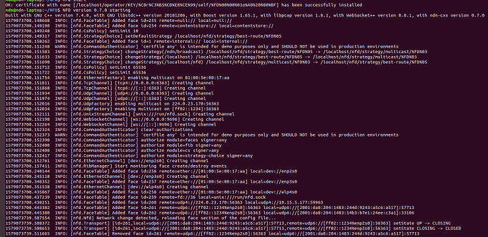

官方提供的安装教程：[http://named-data.net/doc/NFD/current/INSTALL.html](http://named-data.net/doc/NFD/current/INSTALL.html)  
下面提供Ubuntu环境下源码安装NFD的教程

## 下载源文件
``` Shell
# Download ndn-cxx
git clone https://github.com/named-data/ndn-cxx

# Download NFD
git clone --recursive https://github.com/named-data/NFD
```

## 安装依赖
``` Shell
sudo apt-get install build-essential pkg-config libboost-all-dev libsqlite3-dev libssl-dev libpcap-dev
sudo apt-get install doxygen graphviz python-sphinx
```

## 编译安装ndn-cxx
``` Shell
cd ndn-cxx
./waf configure
./waf
sudo ./waf congfigure
sudo ldconfig
```

## 编译安装NFD
``` Shell
cd NFD
./waf configure
./waf
sudo ./waf install
sudo cp /usr/local/etc/ndn/nfd.conf.sample /usr/local/etc/ndn/nfd.conf
```

## 测试
命令行输入：`nfd-start`，出现如下内容即表示安装成功  
