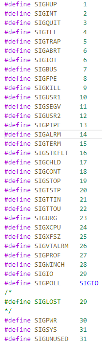
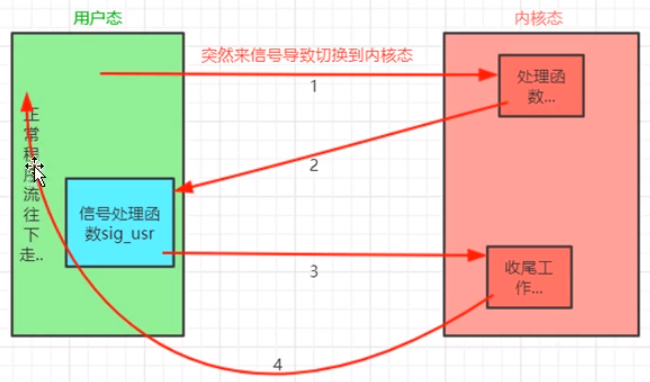

## 什么是信号？
在Linux中信号是进程间通信的重要手段，信号可以通知一个进程发生了什么，信号的产生是突发事件，所以也被称为“软件中断”  
通过查看<signal.h>文件了解到信号是宏定义的常量，以SIG开头  
  
值得注意的是：不存在值为0的信号，值为0的信号称为空信号，kill函数对值为0的信号有特殊的应用

## 信号的来源
信号的来源有两种：
* 内核发送给用户进程，这种情况一般是硬件异常导致的
* 一个用户进程发送给另一个用户进程，比如进程调用kill()向其他进程或者进程组发送信号，注意这种情况是有限制的，要求发送信号的进程和接收信号的进程的所有者相同，或者发送信号进程的所有者是root

## 信号处理动作
当一个进程收到一个信号，有三种处理方式：**[1]**
* 执行系统默认动作：大多数信号的系统默认都做都是终止进程
* 忽略信号：大多数信号都可以忽略，但是SIGKILL(9)和SIGSTOP(19)是不能被忽略的，因为这两个信号向root用户提供了使进程终止和停止的可靠方法
* 捕获信号：捕获信号是指信号发生时执行进程指定的信号处理函数，SIGKILL(9)和SIGSTOP(19)同样不能被捕获
如何忽略和捕获信号，下面会有示例代码

## 常用信号举例
| 信号名 | 信号值 | 信号含义 | 系统默认动作 |
| :---: | :---: | --- | --- |
| SIGHUP | 1 | 终端断开信号，远程登录时，如果终端接口检测到连接断开时，<br>则将该信号发送给与该终端相关的控制进程 | 终止进程 |
| SIGINT | 2 | Ctrl+C触发该信号 | 终止进程 |
| SIGQUIT | 3 | Ctrl+\触发该信号 | 终止进程 + core转储 |
| SIGKILL | 9 | 杀死任意进程的可靠方法，不能被忽略和捕获 | 终止进程 |
| SIGUSR1 | 10 | 用户定义信号1，可用于应用程序 | 终止进程 |
| SIGSEGV | 11 | 访问无效内存会触发该信号 | 终止进程 + core转储 |
| SIGUSR2 | 12 | 用户定义信号2，同SIGUSR1 | 终止进程 |
| SIGPIPE | 13 | 写入无人读取的管道时会触发该信号，网络编程时要处理该信号 | 终止进程 |
| SIGALRM | 14 | 超时信号，调用alarm()，超时后会收到该信号 | 终止进程 |
| SIGTERM | 15 | kill(1)命令默认发送的信号 | 终止进程 |
| SIGCHLD | 17 | 子进程状态改变，子进程终止或者停止时会向父进程发送该信号 | 忽略 |
| SIGCONT | 18 | 使暂停进程继续执行，如果收到该信号的进程处于停止状态，<br>则进程继续执行，不过变为了后台执行。否则忽略该信号 | 继续/忽略 |
| SIGSTOP | 19 | 停止信号，不能被捕获和忽略 | 暂停进程 |
| SIGTSTP | 20 | 终端停止信号，可以被捕获和忽略，Ctrl+Z触发该信号 | 暂停进程 |

## 重新认识kill命令
之前对kill命令的认识是，用来杀死一个进程（终止进程）
``` Shell
kill pid
```
kill命令的实质是给进程发送一个信号（默认发送SIGTERM终止信号），如果进程没有对该信号的处理程序，则执行默认处理动作--终止进程 
kill命令可以给进程发送多种信号
``` Shell
kill -n pid
```
n表示信号值，比如：kill -1 10000，会向pid = 10000的进程发送一个SIGHUP信号，如果没有对SIGHUP信号的处理的话，执行默认处理动作，将终止进程

## signal函数
signal()可以给指定信号注册一个信号处理动作，函数原型如下：**[2]**
``` C++
#include <signal.h>

typedef void(*sighandler_t)(int);
/*
 * @param signum：指定信号
 * @param handler：信号处理动作
*/
sighandler_t signal(int signum, sighandler_t handler);
```
示例代码
* 忽略SIGINT信号
``` C
#include <stdio.h>  // printf
#include <unistd.h> // sleep
#include <signal.h> // signal

int main(){
  if(signal(SIGINT, SIG_IGN) == SIG_ERR){
    printf("signal error\n");
  }

  while(1){
    printf("sleep 1s\n");
    sleep(1);
  }
  
  return 0;
}
```
代码编译执行后，键盘按Ctrl+C无法终止程序运行  
SIG_IGN和SIG_ERR都是<signal.h>中定义的常量
``` C
#define SIG_ERR (void (*) ())-1
#define SIG_IGN (void (*) ())1
```
* 捕获SIGUSR1和SIGUSR2信号
``` C
#include <stdio.h>  // printf
#include <unistd.h> // sleep
#include <signal.h> // signal

void sig_usr(int sig){
  if(sig == SIGUSR1){
    printf("收到了SIGUSR1信号\n");  
  }
  else if(sig == SIGUSR2){
    printf("收到了SIGUSR2信号\n");
  }
}

int main(){
  if(signal(SIGUSR1,sig_usr) == SIG_ERR){
    printf("signal error\n");
  }
  else if(signal(SIGUSR2,sig_usr) == SIG_ERR){
    printf("signal error\n");
  }

  while(1){
    printf("sleep 1s\n");
    sleep(1);
  }

  return 0;
}
```
代码编译执行后，用kill命令发送SIGUSR1和SIGUSR2信号会触发执行sig_usr()，处理流程如下图所示：  
  
在没有信号来之前，程序运行在用户态，信号来之后，程序会切换到内核态判断当前进程对该信号的处理动作是什么，这里指定了sig_usr()作为信号处理动作，所以返回到用户态执行sig_usr()，执行结束之后还是要返回到内核态做一些工作，最后返回用户态继续执行  

## 可重入函数
信号处理函数是不能随意写的，稍微修改上面程序如下：
``` C
#include <stdio.h>  // printf
#include <unistd.h> // sleep
#include <signal.h> // signal

int gNum;
void set_num(int num){
  gNum = num;
}

void sig_usr(int sig){
  set_num(1);

  if(sig == SIGUSR1){
    printf("收到了SIGUSR1信号\n");
  }
  else if(sig == SIGUSR2){
    printf("收到了SIGUSR2信号\n");
  }
}

int main(){
  if(signal(SIGUSR1,sig_usr) == SIG_ERR){
    printf("signal error\n");
  }
  else if(signal(SIGUSR2,sig_usr) == SIG_ERR){
    printf("signal error\n");
  }

  while(1){
    set_num(0);
    printf("gNum = %d\n", gNum);

    printf("sleep 1s\n");
    sleep(1);
  }

  return 0;
}
```
在main函数和信号处理函数中都去修改全局变量gNum的值，由于信号处理函数是随时可能被调用的，printf在打印是gNum不是确定的，根据这个例子就能引出可重入函数的概念  
**可重入函数是指：在信号处理函数中调用该函数是安全的，不会出现不确定的情况**  
所以上面代码中的set_num()不是一个可重入的函数，还有像malloc()、printf()这些常用的函数也不是可重入函数
由此也可以总结编写信号处理函数的注意事项：
1. 信号处理函数中只做简单操作，尽量不要调用系统函数
2. 如果非要调用系统函数，则要保证系统函数是可重入的
3. 可重入的系统函数可能会对errno这个全局变量做修改，此时应在信号处理函数开始对errno进行备份，在末尾在进行还原

## 参考文献
* [1]. 《UNIX环境高级编程》第三版
* [2]. Linux man-pages：man 2 signal