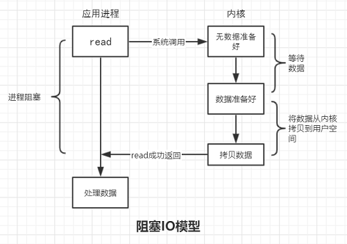
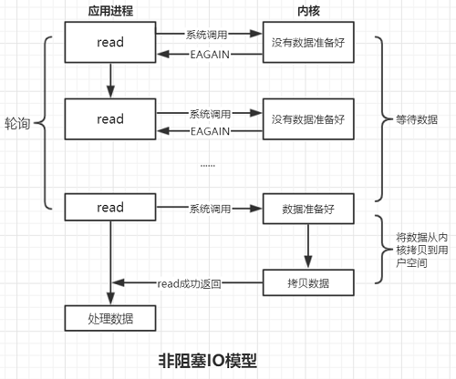
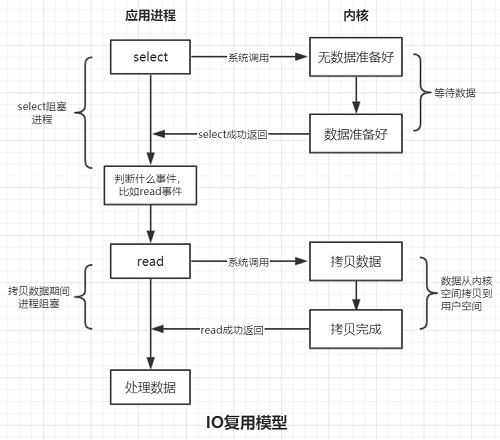
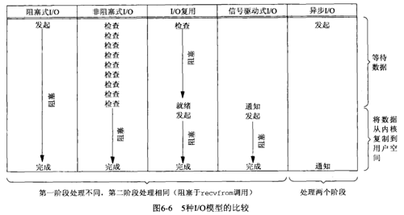

# Unix下的IO模型
Unix下可用的IO模型有五种 **[1]**：
* 阻塞式IO
* 非阻塞式IO
* IO复用（select和poll）
* 信号驱动IO（SIGIO）
* 异步IO（POSIX的aio_系列函数）

下面介绍自己对前三种IO模型的理解，后面两种模型如果之后有机会接触到，再回来补充！  

## 阻塞式IO
程序执行一个系统调用时，会进行休眠等待返回结果，不在执行之后的代码  
比如服务器端以阻塞IO方式调用read()读取客户端发来的数据时，代码和流程如下所示：
``` C++
while(connSocket.read(buf, BUFFER_SZ) > 0){  // 1
  // 处理接收到的数据                           // 2
}
```
  
调用read()函数，由用户态切换到内核态，查看接收缓存区是否有数据，如果有数据，则将数据从内核拷贝到用户空间，否则等待对端发送数据，此时应用进程阻塞在1处，无法继续执行，直到read()返回  
可见阻塞IO效率低，因为阻塞等待是在浪费进程所获得的执行机会，所以一般采用非阻塞方式编写服务器程序  
**注意：read()并不一定是阻塞的，取决于套接字是否是阻塞的**  

## 非阻塞式IO
非阻塞IO是系统调用时不会等待数据准备好才返回，而是立即返回，此时可以执行之后的程序，所以程序运行过程中没有进入休眠状态  
比如以非阻塞方式调用read()读取对端发来数据的过程：
``` C++
for(;;){
  len = connSocket.read(buf, BUFFER_SZ);
  if(len < 0){
    if(errno == EAGAIN){  // 没有数据准备好
      continue;
    }
    else{
      break;
    }
  }

  if(len == 0){          // 客户端关闭连接
    break;
  }

  connSocket.write(buf, len);
}
```
    
调用read()陷入内核，查看接收缓冲区中是否有数据，如果没有数据则read()立即返回，返回值为-1，error = EAGAIN，此时应用进程可以执行一些其他代码，之后再次调用read()判断是否有数据准备好  
也就是在数据准备好之前应用进程虽然不会被阻塞，但是为了能接收到数据就必须要轮询数据是否准备好，显然这样的效率也不高

## IO复用
IO复用是指不再让具体的系统调用（accept、read）阻塞程序执行，而是选择一个代理，这个代理可以同时观察多个IO事件，比如既能观察监听套接字的可读事件也能观察连接套接字的可读事件，在没有事件发生时，代理将当前线程阻塞掉，当有一个或者多个事件发生时，代理从阻塞态醒来，之后程序继续执行后面处理IO的逻辑，我们来看一个例子：
``` C++
for(;;){
  ::select(..., &rfds, ...);

  if(FD_ISSET(listenfd, &rfds)){          // 1
    connfd = accept(listenfd, ...);
    connPool.push_back(connfd);
  }

  for(connfd : connPoll){                 
    if(FD_ISSET(connfd, &rfds)){          // 2
      ::read(connfd, ...);
      // 数据处理
  }
}
```
  
程序不再阻塞在accept（等待连接），read（等待接收数据）处，而是阻塞在select，不管是listenfd的可读事件还是connfd的可读事件发生时，select都会返回，之后程序判断发生什么事件，比如伪码中1处是判断是否是listenfd的可读事件，2处是判断是否是connfd的可读事件。  
综上所述，IO复用的核心思想就是：将系统调用导致的进程阻塞统统转移到一个代理处，代理在阻塞期间不断查看多个文件描述符的IO准备情况，有事件发生时则返回，这样后面真正做事情的系统调用（比如accept、read）就不再阻塞进程了，大大提高了效率，并且可以让单线程程序具备了并发处理的能力。

## 信号驱动IO

## 异步IO

## 同步IO和异步IO
同步IO的定义：导致请求进程阻塞，直到IO操作完成 **[1]**  
异步IO的定义：不导致请求进程阻塞  
  
如上图所示：阻塞IO、非阻塞IO、IO复用、信号驱动IO都属于同步IO，只有最后一个异步IO模型才是真正的异步IO

## 参考文献
* [1]. 《Unix网络编程 卷1：套接字联网API》第三版